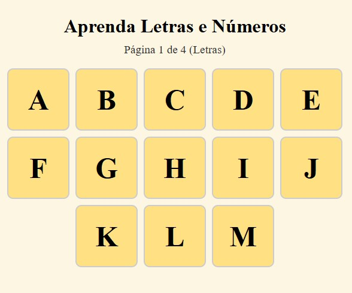
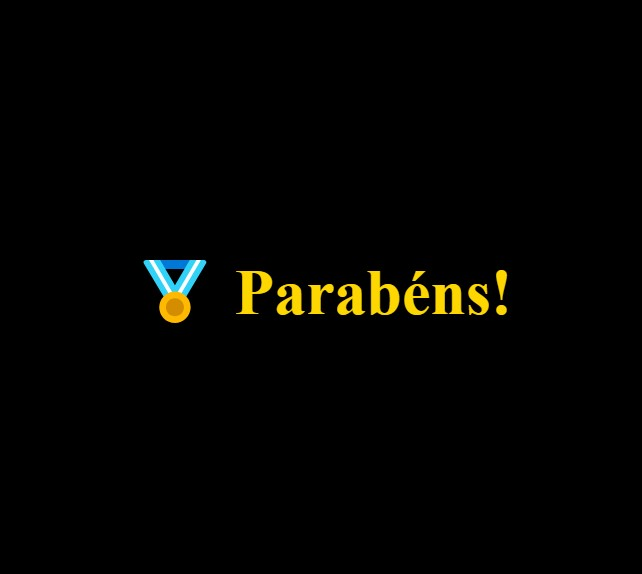

# 🧠 Jogo Educativo Interativo

**Jogo Educativo Interativo** é uma aplicação web leve e amigável desenvolvida com **Python + Flask**, voltada para crianças em fase de alfabetização. Ela apresenta letras e números com sons em português, incentivando o aprendizado de forma lúdica, auditiva e visual.

---

## 🌐 Demonstração Online

Você pode acessar e testar o jogo diretamente em:

👉 [https://jogo.valega.dev](https://jogo.valega.dev)

---

## 🌍 Idiomas Disponíveis

- 🇧🇷 Português – *Você está aqui*
- 🇪🇸 [Versión en Español](https://github.com/jorgevalega/juego-educativo)
- 🇺🇸 [English Version](https://github.com/jorgevalega/educational-game)

---

## 🚀 Funcionalidades

- ✅ Exibição de **letras maiúsculas e minúsculas**, agrupadas em páginas
- 🔢 Contagem de **0 a 100**, separada de forma didática (0–10, 11–20, ...)
- 🔊 Reprodução de áudio para cada letra e número
- 🏅 Feedback positivo com **medalha e som de parabéns**
- 📱 Interface responsiva para uso em celular, tablet ou desktop
- 🔄 Navegação automática entre páginas (sem botões)
- 🎉 Finalização com efeito visual e opção de reinício

---

## 📸 Capturas de Tela




---

## 🛠️ Instalação

**1. Pré-requisitos**  
Certifique-se de que você tenha **Python 3.8 ou superior** instalado no sistema.

**2. Clone o repositório**

```bash
git clone https://github.com/jorgevalega/jogo-educativo.git
cd jogo-educativo
```
**3. Crie e ative um ambiente virtual (recomendado)**

```bash
python -m venv venv
source venv/bin/activate       # Linux/macOS
venv\Scripts\activate          # Windows
```
**4. Instale as dependências**

```bash
pip install -r requirements.txt
```

---

## ▶️ Como usar

**1. Execute a aplicação localmente com:**

```bash
python src/app.py
```

**2. Abra o navegador e acesse:**

```bash
http://localhost:5000
```

**3. Toque nas letras ou números para ouvir sua pronúncia.**
Ao completar uma página, uma medalha aparece com som de parabéns e a aplicação avança automaticamente para a próxima página.

---

## 📁 Estrutura de Pastas

```bash
jogo-educativo/
├── env/
├── LICENSE
├── README.md
├── requirements.txt
├── src/
│   ├── app.py
│   ├── assets/
│   │   ├── jogo.jpg
│   │   └── parabens.jpg
│   ├── services/
│   │   ├── page_service.py
│   ├── setup.py
│   ├── static/
│   │   ├── audio/
│   │   │   ├── 0.mp3
│   │   │   ├── 1.mp3
│   │   │   ├── ... (vários arquivos de áudio)
│   │   │   └── Z.mp3
│   │   │   └── parabens.mp3
│   │   ├── css/
│   │   │   └── styles.css
│   │   └── javascript/
│   │       └── main.js
│   ├── templates/
│   │   └── index.html
│   └── utils/
```

---

## 🧾 Dependências

- `flask` — Framework web leve e poderoso para Python
- `gtts` (opcional) — Utilizado para gerar os áudios em MP3 (Text-to-Speech do Google)

Todas as dependências necessárias estão listadas em [`requirements.txt`](requirements.txt).

---

## 🧑‍💻 Autor

Desenvolvido por [Jorge Valega](https://github.com/jorgevalega) – apaixonado por automação, acessibilidade e ferramentas de aprendizado de idiomas.

---

## 📄 Licença

Este projeto está licenciado sob a [Licença MIT](LICENSE).

---

## ☕ Apoie o projeto

Se este jogo for útil para você ou sua família, deixe uma ⭐ no GitHub ou compartilhe com amigos e educadores!
